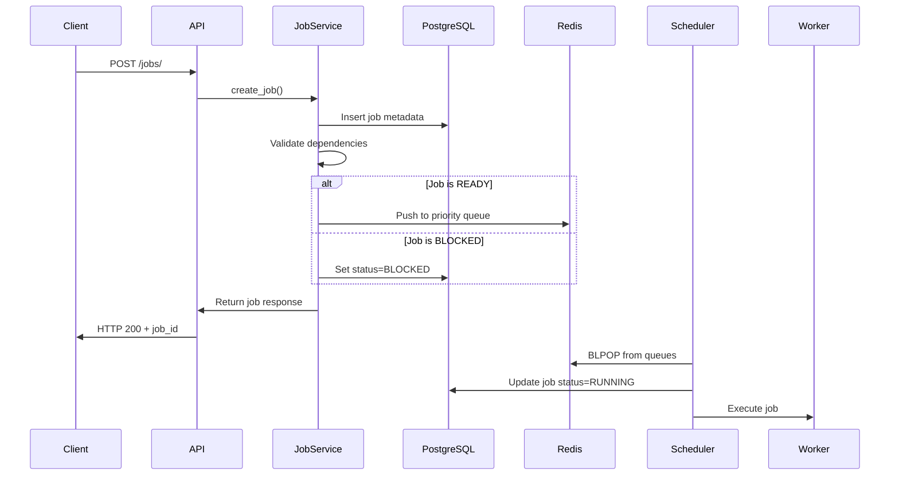
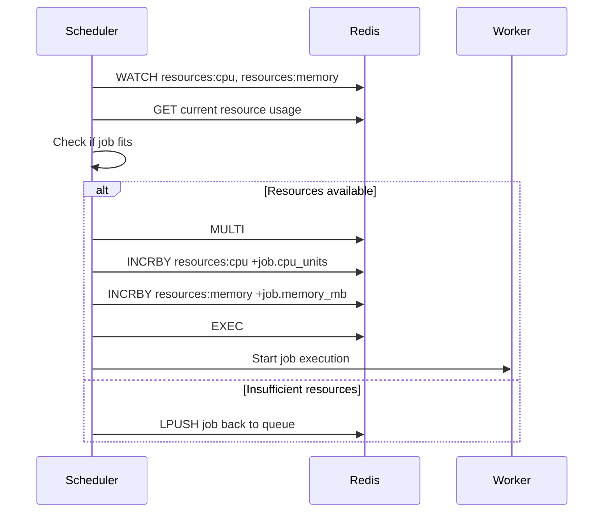

# 🏗️ Architecture & Design Decisions

This document explains the architectural choices, design patterns, and technical decisions behind the Draconic Task Queue System.

## 📋 Table of Contents

- [System Overview](#system-overview)
- [Core Components](#core-components)
- [Design Decisions](#design-decisions)
- [Data Flow](#data-flow)
- [Performance Optimizations](#performance-optimizations)
- [Scalability Considerations](#scalability-considerations)
- [Trade-offs & Alternatives](#trade-offs--alternatives)

## 🎯 System Overview

The Draconic Task Queue System is designed as a **distributed, fault-tolerant job processing system** that prioritizes:

1. **High Throughput**: Handle thousands of jobs per second
2. **Low Latency**: Sub-100ms job submission times
3. **Reliability**: Zero job loss with proper error handling
4. **Scalability**: Horizontal scaling across multiple workers
5. **Observability**: Complete visibility into system operations

### Key Design Principles

- **Event-Driven Architecture**: Redis queues for real-time job processing
- **Separation of Concerns**: Clear boundaries between API, scheduling, and execution
- **Atomic Operations**: Redis transactions for resource allocation
- **Idempotency**: Safe retry mechanisms without side effects
- **Graceful Degradation**: System continues operating under partial failures

## 🧩 Core Components

### 1. FastAPI Application Layer

**Purpose**: HTTP API interface and WebSocket management

**Key Decisions**:
- **FastAPI over Flask/Django**: Better async support, automatic OpenAPI docs, type hints
- **Pydantic Schemas**: Runtime validation and serialization
- **Async/Await**: Non-blocking I/O for better concurrency

```python
# Example: Job submission endpoint
@router.post("/", response_model=JobResponse)
async def create_job(job_data: JobCreate, job_service: JobService = Depends()):
    return await job_service.create_job(job_data)
```

### 2. Redis Queue System

**Purpose**: High-performance job queuing with priority support

**Key Decisions**:
- **Redis over RabbitMQ/Kafka**: Simpler setup, atomic operations, built-in data structures
- **Priority Queues**: Separate Redis lists for each priority level
- **BLPOP Operations**: Blocking pop for instant job pickup (O(1) complexity)
- **Atomic Resource Allocation**: WATCH/MULTI/EXEC for race condition prevention

```python
# Priority queue structure in Redis
QUEUE_CRITICAL = "queue:critical"
QUEUE_HIGH = "queue:high" 
QUEUE_NORMAL = "queue:normal"
QUEUE_LOW = "queue:low"

# Resource tracking
RESOURCE_CPU = "resources:cpu"
RESOURCE_MEMORY = "resources:memory"
```

### 3. PostgreSQL Persistence Layer

**Purpose**: Durable job metadata and execution history

**Key Decisions**:
- **PostgreSQL over MongoDB**: ACID compliance, complex queries, JSON support
- **SQLAlchemy ORM**: Type safety, relationship management, migration support
- **Async Driver (asyncpg)**: Non-blocking database operations
- **Composite Indexes**: Optimized queries for job status and dependencies

```sql
-- Key indexes for performance
CREATE INDEX idx_jobs_status_priority ON jobs(status, priority, created_at);
CREATE INDEX idx_job_dependencies_parent ON job_dependencies(parent_job_id);
```

### 4. Worker Pool Architecture

**Purpose**: Distributed job execution with resource management

**Key Decisions**:
- **Process-based Workers**: Better isolation than threads
- **Resource Tracking**: CPU units and memory allocation
- **Graceful Shutdown**: Complete running jobs before termination
- **Error Isolation**: Job failures don't affect other jobs

### 5. Dependency Management System

**Purpose**: DAG-based job orchestration

**Key Decisions**:
- **Directed Acyclic Graph (DAG)**: Prevents circular dependencies
- **Cycle Detection**: Topological sort algorithm
- **Lazy Evaluation**: Dependencies checked only when needed
- **Cascade Failures**: Failed parents block dependent jobs

## 🔄 Data Flow

### Job Submission Flow



### Resource Allocation Flow



## 🚀 Performance Optimizations

### 1. Redis Queue Operations (O(1))

**Problem**: Traditional job queues often use O(log n) priority queues
**Solution**: Separate Redis lists for each priority level

```python
# Instead of single priority queue O(log n)
priority_queue.push(job, priority)

# Use separate queues O(1)
redis.lpush(f"queue:{priority}", job_data)
```

### 2. Atomic Resource Allocation

**Problem**: Race conditions in resource allocation
**Solution**: Redis WATCH/MULTI/EXEC transactions

```python
async def allocate_resources(self, job):
    async with self.redis.pipeline(transaction=True) as pipe:
        await pipe.watch('resources:cpu', 'resources:memory')
        current_cpu = await pipe.get('resources:cpu') or 0
        current_memory = await pipe.get('resources:memory') or 0
        
        if can_allocate(current_cpu, current_memory, job):
            pipe.multi()
            pipe.incrby('resources:cpu', job.cpu_units)
            pipe.incrby('resources:memory', job.memory_mb)
            await pipe.execute()
            return True
        return False
```

### 3. Database Query Optimization

**Problem**: Slow queries with millions of jobs
**Solution**: Strategic indexing and query optimization

```sql
-- Composite index for common query patterns
CREATE INDEX idx_jobs_status_priority_created 
ON jobs(status, priority, created_at) 
WHERE status IN ('READY', 'RUNNING', 'BLOCKED');

-- Partial index for active jobs only
CREATE INDEX idx_active_jobs 
ON jobs(updated_at) 
WHERE status NOT IN ('COMPLETED', 'FAILED', 'CANCELLED');
```

### 4. Connection Pooling

**Problem**: Database connection overhead
**Solution**: Async connection pools

```python
# SQLAlchemy async engine with pooling
engine = create_async_engine(
    DATABASE_URL,
    pool_size=20,
    max_overflow=30,
    pool_pre_ping=True,
    pool_recycle=3600
)
```

## 📈 Scalability Considerations

### Horizontal Scaling

1. **Multiple Workers**: Scale job execution capacity
2. **Load Balanced API**: Multiple FastAPI instances behind load balancer
3. **Redis Cluster**: Distribute queue operations across nodes
4. **Read Replicas**: Separate read/write database operations

### Vertical Scaling

1. **Resource Limits**: Configurable CPU/memory limits per worker
2. **Queue Depth**: Monitor and alert on queue backlogs
3. **Database Tuning**: Optimize PostgreSQL configuration

### Auto-scaling Triggers

```yaml
# Example Kubernetes HPA
apiVersion: autoscaling/v2
kind: HorizontalPodAutoscaler
metadata:
  name: worker-hpa
spec:
  scaleTargetRef:
    apiVersion: apps/v1
    kind: Deployment
    name: worker
  minReplicas: 2
  maxReplicas: 20
  metrics:
  - type: External
    external:
      metric:
        name: redis_queue_length
      target:
        type: Value
        value: "100"
```

## ⚖️ Trade-offs & Alternatives

### Redis vs. Traditional Message Queues

**Chosen**: Redis with custom queue implementation
**Alternatives**: RabbitMQ, Apache Kafka, AWS SQS

### Process vs. Thread Workers

**Chosen**: Process-based workers
**Alternatives**: Thread-based, async task execution

**Trade-offs**:
- ✅ **Pros**: Better isolation, CPU-bound task support, crash resilience
- ❌ **Cons**: Higher memory overhead, IPC complexity
- **Mitigation**: Shared Redis state, efficient serialization

### Synchronous vs. Asynchronous Architecture

**Chosen**: Async/await throughout the stack
**Alternatives**: Synchronous with threading

**Trade-offs**:
- ✅ **Pros**: Better I/O concurrency, lower resource usage, modern patterns
- ❌ **Cons**: Complexity, debugging challenges, learning curve
- **Mitigation**: Comprehensive logging, structured error handling

## 🔍 Monitoring & Observability

### Key Metrics

1. **Throughput**: Jobs processed per second
2. **Latency**: Job submission to completion time
3. **Queue Depth**: Pending jobs per priority
4. **Resource Utilization**: CPU/memory usage
5. **Error Rates**: Failed jobs percentage
6. **Dependency Chains**: Average DAG depth

### Logging Strategy

```python
# Structured logging with context
logger.info(
    "Job execution started",
    extra={
        "job_id": job.id,
        "job_type": job.type,
        "priority": job.priority,
        "cpu_units": job.cpu_units,
        "memory_mb": job.memory_mb,
        "worker_id": worker_id
    }
)
```

### Health Checks

```python
# Comprehensive health check
async def health_check():
    checks = {
        "database": await check_database_connection(),
        "redis": await check_redis_connection(),
        "queue_depth": await get_queue_depths(),
        "resource_usage": await get_resource_usage()
    }
    return checks
```

## 🔮 Future Enhancements

### Planned Improvements

1. **Distributed Locking**: Consul/etcd for multi-region deployments
2. **Job Scheduling**: Cron-like scheduling for recurring jobs
3. **Priority Aging**: Boost priority of old jobs
4. **Circuit Breakers**: Prevent cascade failures
5. **Metrics Export**: Prometheus/Grafana integration
6. **Job Chaining**: Dynamic dependency creation
7. **Resource Quotas**: Per-tenant resource limits

### Architectural Evolution

1. **Event Sourcing**: Complete audit trail of job state changes
2. **CQRS**: Separate read/write models for better performance
3. **Microservices**: Split into specialized services (scheduler, executor, API)
4. **Stream Processing**: Real-time analytics with Apache Kafka

---

This architecture balances **performance**, **reliability**, and **maintainability** while providing clear paths for future scaling and enhancement. 